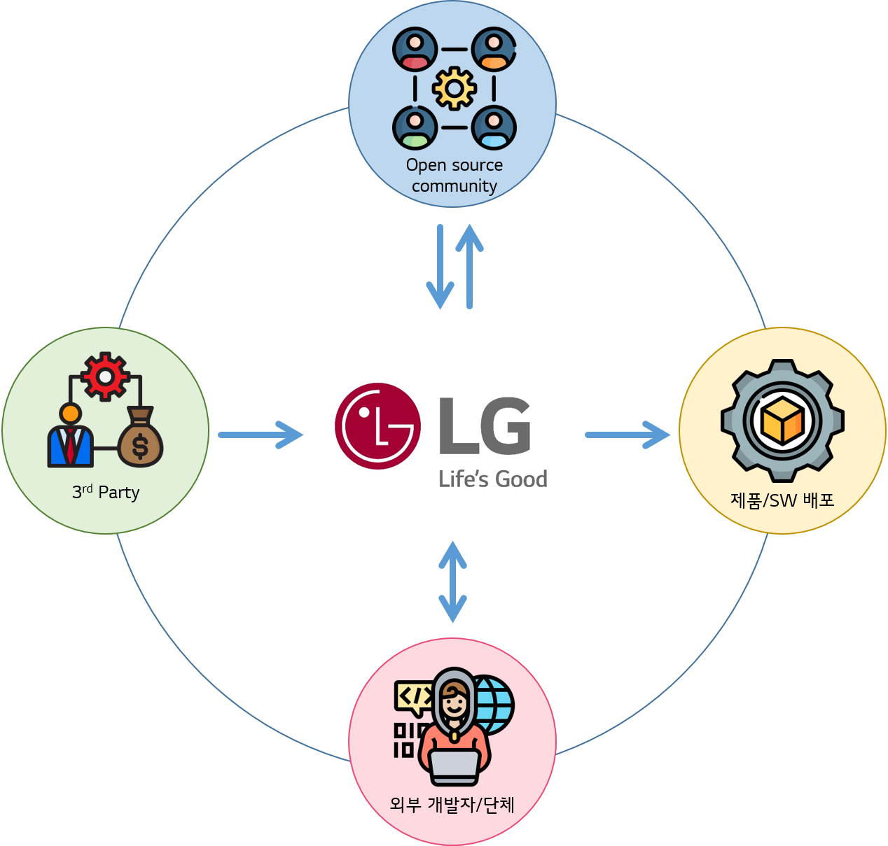

# Open Source Policy

[조직\(Organization\)](../organization/ospo.md)을 구성하였다면, 다음은 정책이 필요합니다. Open Source Policy는 Software를 배포하는 조직이 Open Source를 사용 혹은 기여할 때 지식 재산을 보호하고 Compliance Risk를 완화하기 위해 필요한 것으로, 조직이 효과적으로 Open Source Compliance 활동을 진행하기 위해서는 각 회사가 배포하는 Software 형태, 사업 형태에 따라 그에 맞는 정책이 필요합니다.

다음은 LG전자에서 어떻게 Open Source Policy를 수립하여 OSC 활동을 진행하고 있는지 공개합니다.

 

## LG전자 Open Source Policy

LG전자 Open Source Policy는 LG전자가 배포하는 모든 Software 개발시, LG전자에서 개발한 Software를 Open Source로 공개하거나 Open Source Community에 기여 시에 적용됩니다.  
따라서 Software를 배포하는 LG전자 전 사업부 및 연구소에서는 이를 준수해야 합니다.

LG전자 Open Source Policy는 다음과 같이 구성되어 있습니다.

<table>
  <thead>
    <tr>
      <th style="text-align:left">Policy</th>
      <th style="text-align:left">내용</th>
    </tr>
  </thead>
  <tbody>
    <tr>
      <td style="text-align:left">
        
Open Source

        
사용 Policy

      </td>
      <td style="text-align:left">LG전자가 배포하기 위한 Software에 Open Source를 사용할 때 지식 재산 보호와 Compliance Risk 완화를 위해 준수해야 하는 정책입니다.</td>
    </tr>
    <tr>
      <td style="text-align:left">3rd Party Software 사용 Policy</td>
      <td style="text-align:left">LG전자가 배포하고자 하는 Software에 포함된 3rd Party Software에 대한 Open Source Compliance를 위해 준수해야 하는 정책입니다.</td>
    </tr>
    <tr>
      <td style="text-align:left">
        
Open Source

        
공개/기여 Policy

      </td>
      <td style="text-align:left">LG전자에서 개발한 Software를 Open Source로 공개하거나 기여할 때 준수해야 하는 정책입니다.</td>
    </tr>
    <tr>
      <td style="text-align:left">
        
외부 클레임

        
대응 Policy

      </td>
      <td style="text-align:left">외부로부터 클레임을 받았을 때 효과적으로 대응하기 위해 준수해야 하는 정책입니다.</td>
    </tr>
  </tbody>
</table>
