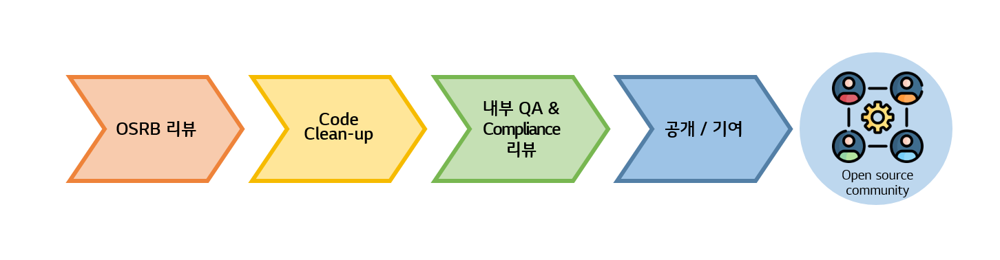

# 공개/기여 Process
사내에서 개발한 Open Source를 공개하거나 기여함으로써 얻을 수 있는 많은 이점으로 인해 Open Source Project 참여를 권장하지만, 회사의 영업 비밀 및 지식 재산 노출 방지를 주의해야 합니다.  
따라서 [Open Source Policy](../../policy/osc_policy.md) 내 Open Source 공개/기여 Policy에 따라 기여 활동을 하기 위해서는 공개/기여 Process에 따라 기여 활동을 수행해야 합니다.

### OSRB Review
OSRB(Open Source Review Board)는 [OSPO](../../organization/ospo.md), 법무팀, 특허팀으로 구성되어 있습니다. Software 개발팀에서 Open Source 공개/기여를 위한 OSRB Review 요청 시,  **Open Source License, 특허, CLA(Contribution License Agreement)**에 대해 검토합니다.  
 

### Code Clean-up
1. [Source Code 내 저작권 및 License 표기 규칙](../osc_process/1-identification/copyright_license_rule.md)을 준수합니다.  
2. 3rd party의 코드는 포함되면 안 되며, 3rd party의 private API와 3rd party와의 인증을 위해 사용된 key 값 등은 삭제되어야 합니다.  
3. 소스코드 내 자사 보안 관련 이슈될 수 있는 사항(Proprietary key, 내부 URL 등), 불필요하게 포함된 빌드 산출물을 삭제해야 합니다.  
 

### 내부 QA & Compliance 리뷰
개발팀은 내부 QA 진행 및 기타 Compliance 사항들을 이행하고 있는지 확인해야 합니다.  
 

### 공개/기여
회사 이메일 주소로 기여 활동을 합니다.
