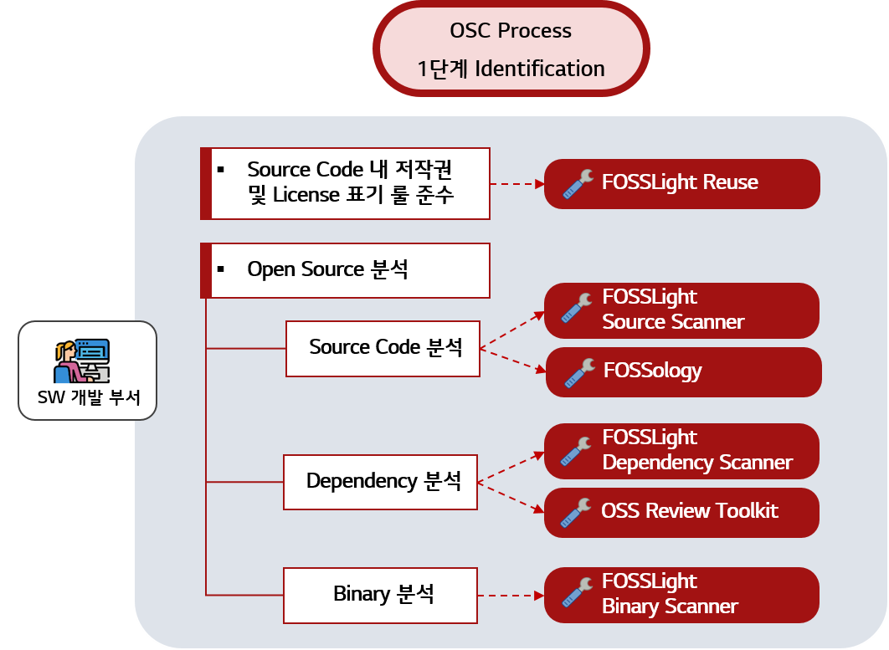

# OSC Tool

효율적인 Open Source Compliance 활동을 위하여 소스 코드 상 Open Source License를 자동으로 분석해주는 툴뿐만 아니라 프로젝트별 Open Source를 관리할 수 있도록 도와주는 툴 등 많은 유용한 툴들이 존재합니다.

이 중 Open Source로 공개되어 있어 누구나 자유롭게 사용할 수 있는 툴들을 소개합니다.

### OSC Process를 위한 Tool

<table>
  <thead>
    <tr>
      <th>Activities of OSC Process </th>
      <th>Tool Name</th>
      <th>Description & Guide</th>
    </tr>
  </thead>
  <tbody>
    <tr>
      <td><b>저작권 및 License  표기 룰 준수 </b></td>
      <td><a href="https://github.com/fosslight/fosslight_reuse"><b>FOSSLight Reuse</b></a></td>
      <td>reuse-tool을 이용하여 소스 코드의 저작권 및 License 표기 규칙을 준수하는지 확인하고 보완하기 위해 사용할 수 있는 도구입니다.
       <a href="https://fosslight.org/fosslight-guide/scanner/1_reuse.html">🔗Guide Link</a></td>
    </tr>
    <tr>
      <td rowspan=2><b>Source Code 분석 </b></td>
      <td><a href="https://github.com/fosslight/fosslight_source_scanner"><b>FOSSLight Source Scanner</b></a></td>
      <td>소스 코드 스캐너인 ScanCode를 이용하여, 파일 안에 포함된 Copyright과 License 문구를 검출합니다.
       <a href="https://fosslight.org/fosslight-guide/scanner/2_source.html">🔗Guide Link</a></td>
    </tr>
    <tr>
      <td><a href="https://www.fossology.org/"><b>FOSSology</b></a></td>
      <td>String Search를 기반으로 한 Open Source 분석 Web Server 어플리케이션입니다.
       <a href="https://oss.lge.com/fossology-guide/">🔗Guide Link</a></td>
    </tr>
    <tr>
      <td rowspan=2><b>Dependency 분석 </b></td>
      <td><a href="https://github.com/fosslight/fosslight_dependency_scanner"><b>FOSSLight Dependency Scanner</b></a></td>
      <td>여러 패키지 매니저에 대한 Dependency 분석을 지원하는 도구로써, 사용된 Dependency들의 License를 포함한 OSS 정보를 자동으로 출력합니다.
       <a href="https://fosslight.org/fosslight-guide/scanner/3_dependency.html">🔗Guide Link</a></td>
    </tr>
    <tr>
      <td><a href="https://oss-review-toolkit.org/">OSS Review Toolkit</a></td>
      <td>프로젝트에 포함된 OSS의 dependency 정보를 자동으로 추출하고, 해당 OSS를 다운로드 받아 Source Code에 대하여 String Search를 기반으로 분석하는 툴입니다.
       <a href="https://oss.lge.com/oss-review-toolkit-guide">🔗Guide Link</a></td>
    </tr>
    <tr>
      <td><b>Binary 분석 </b></td>
      <td><a href="https://github.com/fosslight/fosslight_binary_scanner"><b>FOSSLight Binary Scanner</b></a></td>
      <td>Binary를 찾아 출력하고 Binary DB에 동일하거나 비슷한 Binary가 있으면, 해당 OSS 정보를 출력합니다.
       <a href="https://fosslight.org/fosslight-guide/scanner/4_binary.html">🔗Guide Link</a></td>
    </tr>
  </tbody>
</table>

 
### Open Source 관리 Tool

| Tool Name                                                  | Description & Guide  |                                                                         
| :---------------------------------------------------- | :----------------------------------------- |
| [**FOSSLight Hub**](https://fosslight.org/)             | FOSSLight Hub는 오픈 소스, 오픈 소스 라이선스, 그리고 보안취약점까지 관리해줌으로써 오픈 소스 소프트웨어 사용 시 Compliance를 준수하고 보안취약점으로부터 안전하게 사용할 수 있습니다. 또한 프로젝트 별 BOM 관리, 오픈 소스 라이선스의 의무사항 및 보안취약점 조회 기능을 제공하여 OSC(Open Source Compliance) Process를 수행할 수 있도록 도와줍니다. [🔗Guide Link](https://fosslight.org/fosslight-guide)           |
| [SW360](https://www.eclipse.org/sw360/)             | SW360은 소프트웨어 BOM에 대한 정보를 수집 및 추적하기 위한 웹 애플리케이션 및 저장소를 제공합니다. [🔗Guide Link](https://github.com/eclipse/sw360) | 
